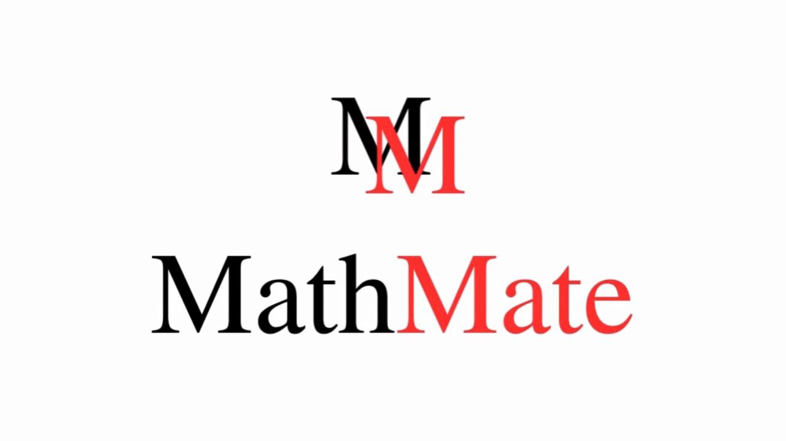

# 

Tutorias Math Mate

De estudiantes, para estudiantes.

    <video autoplay muted playsinline style="display: block; margin: 0; padding: 0; border: none;">
        <source src="media/logo.mp4" type="video/mp4">
        
    </video>

---

Bienvenidos a Math Mate, donde un grupo de estudiantes apasionados por la física y las matemáticas se dedica a ofrecer tutorías personalizadas para estudiantes de colegio y universidad.

 
Nuestro objetivo es ayudar a nuestros estudiantes a comprender los conceptos más complejos de manera clara y accesible. Con un enfoque práctico y personalizado, estamos aquí para apoyarte en tu camino académico.
