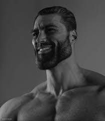
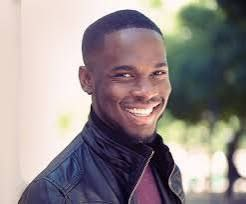

# Integrantes

Conoce a nuestros miembros, quienes son los encargados de guiarte en tu aprendizaje. Somos un equipo de cinco estudiantes de último año de la carrera de Física en la UCR, interesados por diferentes áreas de especialización, pero unidos por la pasión de enseñar y ayudar a nuestros estudiantes a superar los desafíos académicos.

  <!-- Primera fila -->
  

    
    
Carlos Andres Gutierrez Algo – aparecen muchos  en el registro no sé el segundo apellido, especialidad o enfoque de enseñanza

  

  

    
    
Ángel Fabricio Aguirre Bermúdez – especialidad o enfoque de enseñanza

  

  

    
    
Felipe Alberto Mata Mata – especialidad o enfoque de enseñanza

  

  <!-- Segunda fila -->
  

    
    
Diego Chinchilla Muñoz – especialidad o enfoque de enseñanza

  

  

    
    
Andrew Vindas Tenorio - especialidad o enfoque de enseñanza

  

